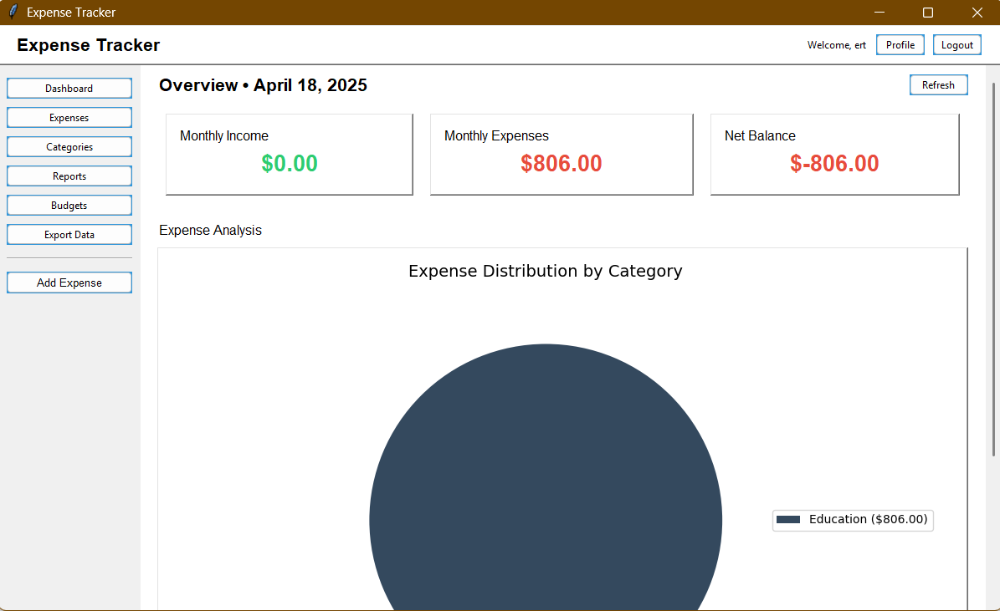
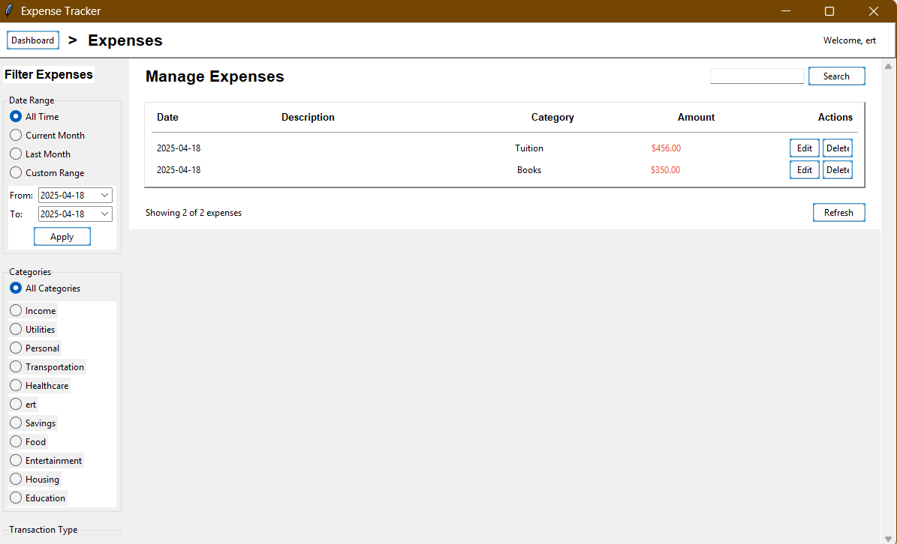
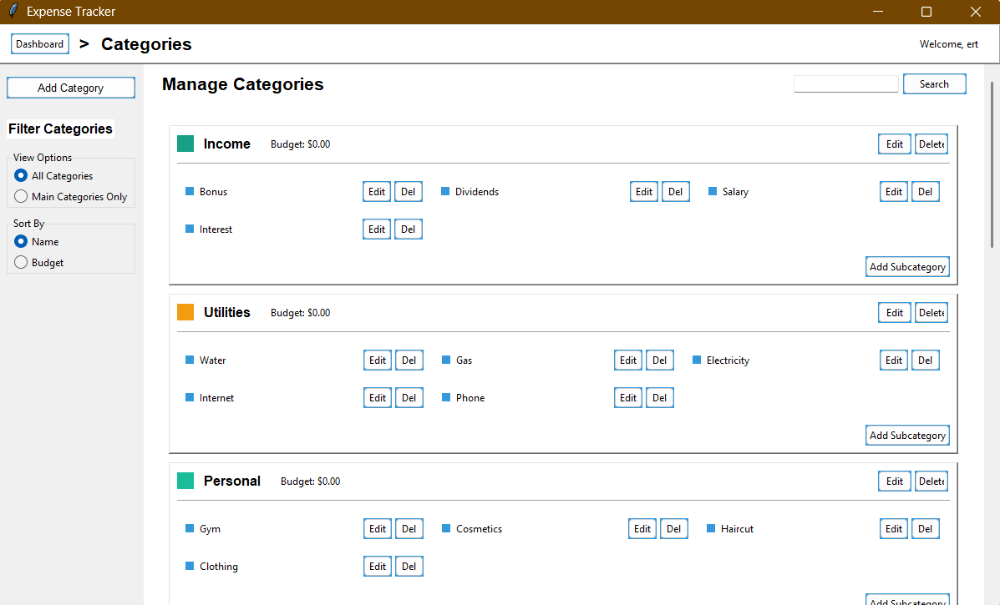

# Expense Tracker

A comprehensive expense tracking system built with Python. This application helps users track expenses, categorize them, and analyze spending habits with an intuitive graphical user interface.



## Features

- **User Management**
  - Multi-user support with secure password handling
  - Personalized profiles with customizable preferences
  
- **Expense Tracking**
  - Add and manage expenses and income transactions
  - Recurring transaction support
  - Transaction tagging and filtering
  - CSV import/export functionality
  
- **Category Management**
  - Hierarchical category system (main categories and subcategories)
  - Color-coded categories for better visualization
  - Default categories provided for quick start
  
- **Budget Management**
  - Set and track monthly budgets by category
  - Visual budget progress indicators
  - Overspending alerts
  
- **Reports and Analytics**
  - Visual dashboard with spending summaries
  - Monthly trend analysis
  - Category distribution charts
  - Spending pattern analysis
  - Anomaly detection for unusual expenses
  
- **User Interface**
  - Intuitive and responsive GUI built with Tkinter
  - Multiple themes (light, dark, blue)
  - Interactive charts and visualizations

## Screenshots




## Installation

### Prerequisites
- Python 3.8+
- Required libraries listed in requirements.txt

### Steps

1. Clone this repository:
   ```
   git clone https://github.com/yourusername/expense-tracker.git
   cd expense-tracker
   ```

2. Create and activate a virtual environment (recommended):
   ```
   python -m venv .venv
   
   # On Windows
   .venv\Scripts\activate
   
   # On macOS/Linux
   source .venv/bin/activate
   ```

3. Install required packages:
   ```
   pip install -r requirements.txt
   ```

4. (Optional) Generate sample data for testing:
   ```
   python utils/generate_sample_data.py
   ```

5. Run the application:
   ```
   python main.py
   ```

## Project Structure

```
expense-tracker/
│
├── main.py                 # Application entry point
├── requirements.txt        # Required packages
├── README.md               # This file
│
├── models/                 # Data models
│   ├── __init__.py
│   ├── user.py             # User model
│   ├── category.py         # Category model
│   └── expense.py          # Expense model
│
├── ui/                     # User interface components
│   ├── __init__.py
│   ├── base.py             # Base UI components
│   ├── login.py            # Login & registration UI
│   ├── dashboard.py        # Main dashboard UI
│   ├── expenses.py         # Expense management UI
│   ├── categories.py       # Category management UI
│   ├── budgets.py          # Budget management UI
│   └── reports.py          # Reports UI
│
└── utils/                  # Utility functions
    ├── __init__.py
    ├── analysis.py         # Data analysis functions
    └── visualization.py    # Chart generation functions
```

## Usage

### First-time Setup

1. Launch the application
2. Create a new account from the login screen
3. Default categories will be automatically created
4. Start adding expenses and income

### Managing Expenses

1. Navigate to the "Expenses" section
2. Use the "Add New Expense" button to record transactions
3. Filter and search for specific expenses
4. Edit or delete existing expenses as needed

### Setting Budgets

1. Go to the "Budgets" section
2. Select a category and set a monthly budget amount
3. Track your spending against budgets
4. Monitor the visual indicators to avoid overspending

### Viewing Reports

1. Visit the "Reports" section
2. View expense distribution by category
3. Analyze monthly spending trends
4. Export reports for further analysis

## Development

### Adding New Features

1. Fork the repository
2. Create a feature branch (`git checkout -b feature/AmazingFeature`)
3. Commit your changes (`git commit -m 'Add some AmazingFeature'`)
4. Push to the branch (`git push origin feature/AmazingFeature`)
5. Open a Pull Request

### Testing and Demo Tools

#### Generate Sample Data

You can generate sample data to test the application:

```
python utils/generate_sample_data.py
```

This script creates:
- A test user account (username: testuser, password: password123)
- Default categories with random budgets
- Random expenses and income transactions over the past 3 months

#### Create Application Screenshots

To create screenshots of the application for documentation:

```
python utils/create_screenshots.py
```

This will automatically:
1. Launch the application
2. Log in with the test user account
3. Navigate to different screens
4. Take screenshots and save them to the `screenshots` directory

### Running Tests

```
pytest tests/
```

## License

This project is licensed under the MIT License - see the LICENSE file for details.

## Acknowledgments

- [Tkinter](https://docs.python.org/3/library/tkinter.html) for the GUI framework
- [Matplotlib](https://matplotlib.org/) and [Seaborn](https://seaborn.pydata.org/) for data visualization
- [Pandas](https://pandas.pydata.org/) for data analysis
- [bcrypt](https://github.com/pyca/bcrypt/) for secure password hashing